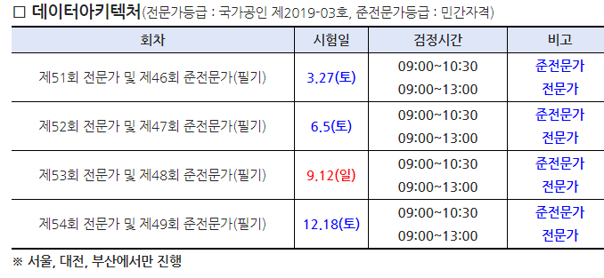
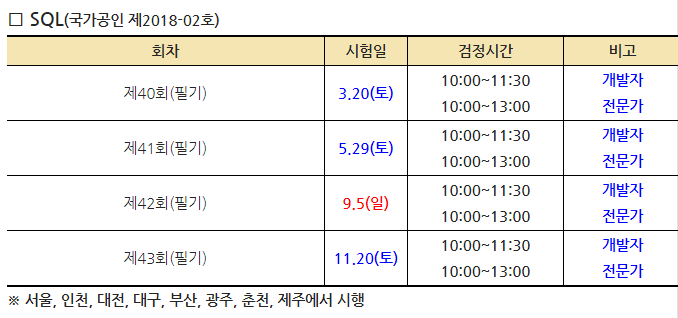
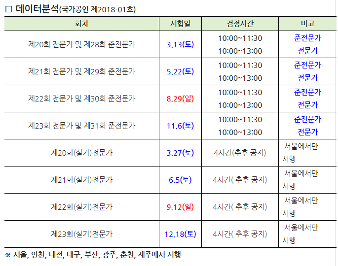

**Remember that there is nothing stable in human affairs; therefore avoid undue elation in prosperity, or undue depression in adversity. -Socrates**
abraxas.
<!--more-->

# 국가공인기술자격

## 정보처리
- [2021 큐넷 계획] (https://github.com/underthelights/underthelights.github.io/blob/main/_posts/certificates/2021qnet.pdf)

### 정보처리 기능사 (2021)
기능사 제1회 정기검정 

  ㅋ- **필기시험** 
  - 원서접수:  1.12∼1.15 
  - 시험시행:  1.31∼2.6 
  - 합격예정자 발표:  2.26(금) 

- 응시자격서류제출(기시험합격자결정) 
  - 해당없음 
  
- **실기시험**
  - 원서접수:  3.2 ∼ 3.5 
  - 시험시행:  4.3∼4.21 
  - 합격자발표:   4.30(1차), 5.7(2차)

- 자격증가산휴가 
  - 알아보기 !!

### 정보처리 산업기사 
**응시자격 : 기능사 취득 1년 이후, 산업기사 취득  (2022. 5월이후)**
산업기사 제3회 정기검정 (2022)
- **필기시험** 
  - 원서접수:  
  - 시험시행:  
  - 합격예정자 발표:  

- 응시자격서류제출(기시험합격자결정) 
  - 해당없음 
  
- **실기시험**
  - 원서접수:  3.2 ∼ 3.5 
  - 시험시행:  4.3∼4.21 
  - 합격자발표:   4.30(1차), 5.7(2차)

### 정보처리 기사

### 정보처리 기술사

## Data Architecture

### DAsP

- **필기시험** 
  - 원서접수:  
  - 시험시행:  3.27. / 6.5. / 9.12. / 12.18. (9 ~ 10:30)
  - 합격예정자 발표:  2.26(금) 

### DAP

## SQL
### SQLD : SQL Developer

- **필기시험** 
  - 원서접수:   
  - 시험시행:  3.20. / 5.29. / 9.5. / 11.20. (10~11:30)
  - 합격예정자 발표:  

- 응시자격서류제출(기시험합격자결정) 
  - 해당없음 
 
- 자격증가산휴가 
  - 알아보기 !!

### SQLP : Professional
- **응시자격**
  - 학력/경력기준 또는 자격기준 중 한가지의 요건이 충족될 경우 응시자격이 부여된다.
  - 학력/경력 기준	
    - 학사학위 이상 취득한 자
    - 전문학사학위 취득 후 실무경력 2년 이상인 자
    - 고등학교 졸업한 후 실무경력 4년 이상인 자
  - 자격기준	
    - 국내·외 데이터베이스 관련 자격을 취득한 자
    - SQL 개발자 자격을 취득한 자
- 합격기준, 증빙서류 

## Data Analysis
: Advanced Data Analytics Semi-Professional

### ADsP

- **필기시험** 
  - 원서접수:  
  - 시험시행:  3.13. / 5.22. / 8.29. / 11.06. (10 ~ 11:30)
  - 합격예정자 발표:  2.26(금) 

- 응시자격서류제출(기시험합격자결정) 
  - 해당없음 
  
- **실기시험**
  - 원서접수:  
  - 시험시행:  3.27. / 6.5. / 9.12. / 12.18. (서울에서만 시행, 4시간)
  - 합격자발표:   4.30(1차), 5.7(2차)

- 자격증가산휴가 
  - 알아보기 !!
  
## 리눅스 마스터 1급 

## 빅데이터 분석기사

* reference
- https://hellokimcoworld.tistory.com/5?category=876227 

# Cloud

## Google Cloud Platform

### GCP Professional Data Engineer
- 후기(https://www.youtube.com/watch?fbclid=IwAR3_VWwYTmlHYUr2i6GamtJ0ONtkMzeCtK3BH3CYu0xNgjePDEv2-yllXqg&v=YLtytLrzAIY&feature=youtu.be&ab_channel=SimonKim)
### GCP Professional Cloud Architect
