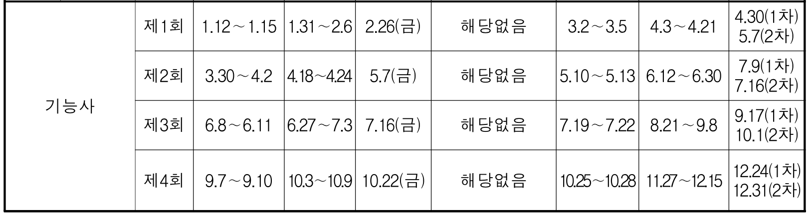

**Remember that there is nothing stable in human affairs; therefore avoid undue elation in prosperity, or undue depression in adversity. -Socrates**
abraxas.
<!--more-->

## Certificates

### 정보처리
- [2021 큐넷 계획] (https://github.com/underthelights/underthelights.github.io/blob/main/_posts/certificates/2021qnet.pdf)

#### 정보처리 기능사 (2021)
기능사 제1회 정기검정 
- 
- **필기시험** 
  - 원서접수:  1.12∼1.15 
  - 시험시행:  1.31∼2.6 
  - 합격예정자 발표:  2.26(금) 

- 응시자격서류제출(기시험합격자결정) 
  - 해당없음 
  
- **실기시험**
  - 원서접수:  3.2 ∼ 3.5 
  - 시험시행:  4.3∼4.21 
  - 합격자발표:   4.30(1차), 5.7(2차)

- 자격증가산휴가 
  - 알아보기 !!

#### 정보처리 산업기사 
**응시자격 : 기능사 취득 1년 이후, 산업기사 취득  (2022. 5월이후)**
산업기사 제3회 정기검정 (2022)
- **필기시험** 
  - 원서접수:  
  - 시험시행:  
  - 합격예정자 발표:  

- 응시자격서류제출(기시험합격자결정) 
  - 해당없음 
  
- **실기시험**
  - 원서접수:  3.2 ∼ 3.5 
  - 시험시행:  4.3∼4.21 
  - 합격자발표:   4.30(1차), 5.7(2차)

#### 정보처리 기사

#### 정보처리 기술사

### 데이터 아키텍트 
#### DAsP

### SQL
#### SQLD

### 리눅스 마스터 1급 

